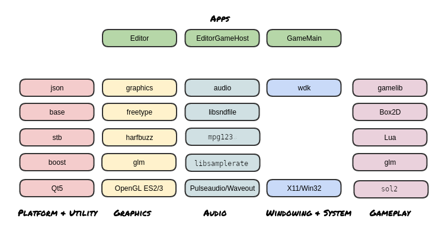

DETONATOR 2D 💥💣
===================

## System Architecture

High level overview of the software stack and the runtime operation.

The repository contains multiple independent libraries for game play, audio, graphics etc.
The engine then contains the "subsystems" that make use of those libraries to implement engine functionality.

### Libraries

Click here for details about the [Audio](audio/README.md "Audio readme") library.  
Click here for details about the [Graphics](graphics/README.md "Graphics readme") library.  
Click here for details about the [Game play](game/README.md "Game readme") library. (TODO)  
Click here for details about the [UI](uikit/README.md "UIKit readme") library.  
Click here for details about the [WDK](https://github.com/ensisoft/wdk/blob/master/README.md "WDK readme") library.  

In addition: 

[base/](base/) contains random utility code, some algorithms, data structures and math.  
[data/](data/) contains a data serialization (based on JSON) abstractions.  
[device/](device/) contains a GPU device abstraction and OpenGL ES2/3 graphics device implementation.  
[esmcripten/](emscripten/) contains the Emscripten build files and main application

### Engine

Click here for details about the [Game Engine](engine/README.md "Engine readme") itself.

### Software Stack

### Runtime Operation Overview

1. There's a standard game engine that is built into a shared library called GameEngine.dll or libGameEngine.so.
2. A launcher application called GameMain will read a config.json file. This JSON file contains information about
   windowing, context creation etc.
1. The launcher application will load the engine library and create an <Engine> instance.
2. The launcher application will create the native window system window and also create the Open GL rendering context,
   which it will then give to the engine instance.
   1. The engine instance will use the context to create the graphics device object.
   2. The engine will create all the other subsystems such as audio, physics, scripting etc.
3. The launcher application will then enter the top-level game loop. Inside the loop it will:
1. Process any window system window events to handle pending keyboard/mouse etc. events and pass them to the engine as needed.
2. Handle requests coming from the engine instance. These could be for example requests to toggle full screen mode.
3. Call the engine method to update the game state.
4. Call the engine method to draw the game state.

Inside the game engine the following will take place.
1. The various subsystems are updated and ticked. These include physics, audio, scripting etc.
2. The renderer is used to draw the current scene.
3. The engine will handle the input events (mouse, keyboard) coming from the host process and choose the appropriate action.
   For example If a UI is being shown the input is passed to the UI subsystem. The inputs are then also passed to the
   game scripting system and ultimately to your game's Lua scripts.
4. The engine will handle the incoming events/requests from the game itself. For example the game might request a scene
   to be loaded or the game to be paused.

The above flow is essentially the same for all platforms across Windows/Linux and HTML5/WASM, except that on the web the
host application (emscripten/main.cpp) creates the WebGL context through JS APIs and there's no shared library for the engine
but rather all the engine code is built into the same WASM blob with the loader/host application.
