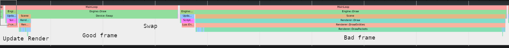
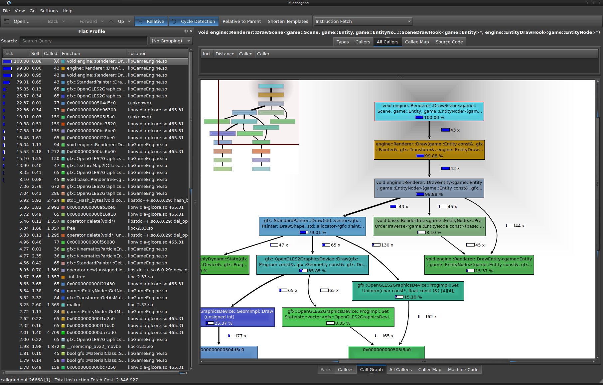

# DETONATOR 2D

## Tracing Overview

The engine has very primitive tracing built in. Most of the top-level subsystem calls to update all subsystems and to render
the scene are wrapped inside trace calls. (The macros and tracing facilities can be found in [base/trace.h](base/trace.h)

```
  TRACE_CALL("Renderer::BeginFrame", mRenderer.BeginFrame());
  TRACE_CALL("Renderer::DrawScene", mRenderer.Draw(*mScene , *mPainter , transform, nullptr, &cull));
```

The tracing allows to quickly get an overview of the frame structure and find out where the frame time is spent. This is ideal
for quickly seeing the janky frames and getting some idea what's going on. The hard problem will be then figuring out
more details of the part that is going wrong. One option is to pepper the code with more trace macros. The alternative
is to use a profiler such as Valgrind or a GPU tool like NVIDIA NSight or RenderDoc

When tracing is enabled the trace is recorded into a trace.json file, that can then be loaded in Chrome/Chromium. 
(Open a new tab and open about::tracing and hit the Load button)

The top most bar of every frame (MainLoop) is the overall frame trace and should not exceed your swap interval.
In other words if you're running with VSYNC turned on (see your game's config.json) this should not exceed your
maximum frame time which is computed as 1.0 / hz. (Where hz is your display's refresh frequency).
In any frame *most* of the time should be spent in Device::Swap given the computational capacity of a modern
computer and GPU and the simplicity of the games in this package.

Overall all frames are composed of the following sequence:
1. Begin new game loop iteration
   1. Call engine begin loop
      1. Call "begin loop" on all engine subsystems
2. Handle events
   1. Handle window system window events
   2. Handle engine requests
3. Update engine
   1. All subsystems update
   2. All subsystems tick (if needed)
4. Draw
   1. Renderer draw scene
   2. Physics draw debug
   3. UI paint UI
   4. Draw engine aux stuff, debug messages, mouse
4. Swap
5. End game loop iteration
   1. Call engine end loop
      1. Call "end loop" on all subsystems




In addition to the native trace macros in [base/trace.h](base/trace.h) the game code can also add trace scopes using
the tracing Lua api calls. Just be careful the balance the calls to *enter* and *leave* correctly or the engine will ASSERT.

```
  
  local index = trace.enter('MyTracingScope, 'comment')
  
  -- do stuff
  
  trace.marker('killroy was here')
  
  -- do stuff
  
  trace.leave(index)  
```

## HTML5/WASM Tracing

When the page has loaded and the game is running there are two ways to star the tracing.

1. Press F12 to show the developer control panel (if not already visible). Then check the tracing checkbox.
2. Control the tracing from the game itself with the Lua API.

In order to access the trace file click on the "Trace" button. Note that this requires the SaveFile.js script
file to be found in the same directory with game.html and all the other files. This allows the file to be 
saved in the local filesystem.


## Linux Tracing and Profiling 💭

The tracing can be turned on in the GameMain application by providing --trace parameter with a name to the file
where to record the trace. There are 2 formats that are supported. A simple text format and a JSON format that is
compatible with Chromium's trace viewer. So for example to trace blast demo one first needs to build the release
package of the game (in Detonator editor) and then navigate to the that directory and launch the game.

```
 $ ./Blast\! --trace trace.json --trace-start
```

This should produce a trace.json file immediately from the application start. Alternatively omit the *--trace-start* 
parameter and use the Lua API in the game to start the tracing programmatically.


### Valgrind + Callgrind + KCachegrind

The biggest problem with valgrind is that it cannot be used for the entire application. It'll be far too slow and the
game will not be able to run properly. Instead, the profiling needs to be turned on and off only for parts of the code.

I've experimented with writing little snippets like.

```
#include <valgrind/callgrind.h>

...

if (some_condition)
{
  CALLGRIND_START_INSTRUMENTATION;
  profiling = true;
}

// do the actual stuff

if (profiling)
{
  CALLGRIND_STOP_INSTRUMENTATION;
}
```
This isn't the simplest way to do to it and requires having to rebuild the game engine but definitely allows for the
most fine-grained control as-to when to capture the profiling information and can limit the instrumentation to a scope that
is actually manageable and keeps the game still in a runnable state.
Then in order to run game with the profiler do:

```
  $ valgrind --tool=callgrind --instr-atstart=no ./Blast\!
```

Once the tracing and profiling has ended use kcachegrind to open the callgrind chart.

```
  $ kcachegrind callgrind.out.xxxx
```



https://valgrind.org/docs/manual/cl-manual.html#cl-manual.basics