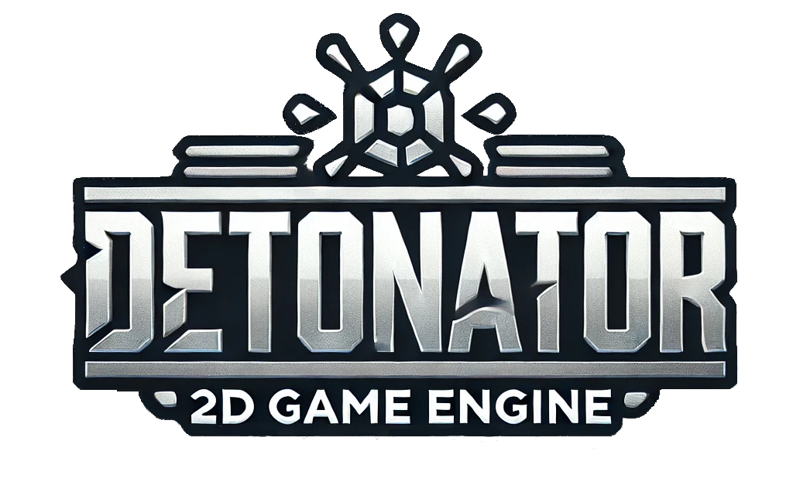
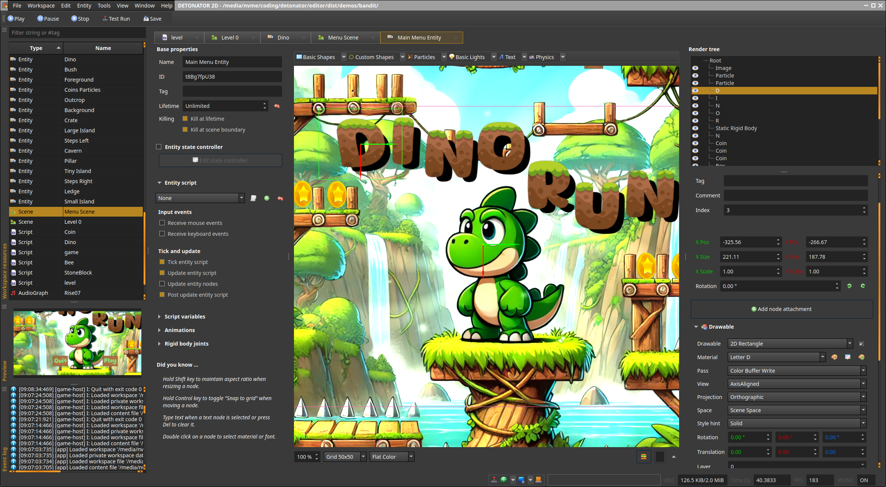

DETONATOR 2D 💣💥
===================

An OpenGL ES3 based 2D game engine and editor for Linux, Windows and HTML5. Designed for simple single player games such
as puzzle games 🧩, platformers 🍄, side scrollers and tile based real time strategy and tactics 🗺️.

### CURRENT TOP FEATURES 🔥

* <b>Run everything locally on your machine</b> 💻
  * <i>No accounts, no tracking, no fuss. Just extract the binary and run!</i>  
* <b>Supports Windows, Linux and HTML5/WASM</b> 🪟🐧🌐
  * <i>Game packages for all platforms built directly in the editor</i> 
* <b>Fully featured editor for game development </b> 💯
  * <i>Everything visual can be completed in the editor </i> 
* <b>Fully documented Lua API for game development</b> 💯
  * <i>Over 1000 methods and over 100 tables !</i> 
* <b>Simple object oriented APIs.</b> 🧱
  * <i>Main game object and game play APIs are Scene, Entity and EntityNode + Attachments</i>
* <b>Demo content and examples. </b> 🪜
  * <i>Multiple demo projects ready to run!</i>  
* <b>Support for scripting and native game development</b> 🍌
  * <i>Write your game logic in Lua or in C++</i>
  

<strong>Click here for more features...</strong>

* Windows, Linux and HTML5/WASM support
* Qt5 based WYSIWYG editor
* Text rendering (vector and bitmap)
* Various primitive shapes, custom polygon shapes
* Material system with built-in materials and with custom shaders
* Particle system with projectile and linear motion
* Entity system with animation tracks
* Audio engine with approx. dozen audio elements
* Lua based scripting for entities, scenes and UIs
* Native (C++) game development support
* Built-in Lua script editor with code formatting, API help and code completion
* Scene builder
* In game UI system
  * Animation ready through simple CSS inspired keyframe declarations
  * Styling support through JSON style files *and* material system integration
  * Virtual key support and mouse input support
  * Scripting support for integrating with the game
* Tilemap builder for tile based worlds
  * Multiple render and data layers
  * Isometric (dimetric) and axis aligned top down support
  * Combines with scene and its entities!
* Physics engine based on Box2D
* Demo content and starter content
* Game content packaging for native and HTML5/WASM (with Emscripten)
* Resource archives, export and import between projects (in zip)
* Tilemap importer, several handy dialogs for materials, fonts, colors etc.
* Several other tools such as:
  * Image packer (for packing textures manually when needed)
  * Bitmap font mapper (map glyps to characters and vice versa)
  * SVG viewer and PNG exporter
  * VCS (Git) integration for syncing project changes to Git
* Built-in tracing in the engine that produce performance traces related to game /engine perf.
* Debug printing, logging, pause/step, screenshot
* Quick play and preview mode with hot content reloading (save your asset and changes will apply)
* Customizable previews (with Lua scripts)
* Several included fonts and particle textures 

### LINKS

<strong>FIND THE DEV BLOG ON ITCH.IO</strong> 
<strong>https://ensisoft.itch.io/detonator</strong>

<strong>PLAY THE DEMOS ON GAMES123.NET</strong> 
<strong>https://games123.net</strong>

## GETTING STARTED 👈

1. Download the latest binary from the releases page 
   https://github.com/ensisoft/detonator/releases
2. Unzip the .zip file anywhere on your computer for example `C:\detonator`
3. Run `C:\detonator\Detonator.exe`
4. Load any of the sample workspaces by clicking on a button in the main screen.
5. Press F4 to launch the sample game.

#### How to Uninstall
If you want to remove the app simply:
1. Delete the detonator folder. `C:\detonator`
2. Delete the user settings folder `C:\Users\<username>.GameStudio`

#### Install from Sources

If you want to:

* Write native (C++) game code
* Use the latest development version
* Use Detonator on LINUX
* Hack on the engine or the editor

then follow the [Build Instructions](BUILDING.md)

## SCREENSHOTS

<i>Scene editor with 'Steam Punk' editor skin</i> 

<strong>Click here for more screenshots...</strong>

 

<i>Create tile based maps using the tile editor. The map supports multiple layers and both isometric and axis aligned perspective.
The map can then be combined with the scene and the scene based entities in order to produce the final game world.</i>  

<i>Create animated game play characters in the entity editor. Each entity can contain an arbitrary render tree
of nodes with various attachments for physics, rendering, text display etc. The entity system supports scriptable
animation state graph as well as animation tracks for managing animation and entity state over time.
Each entity type can then be associated with a Lua script where you can write your entity specific game play code.</i>  

<i>Create materials using the material editor by adjusting properties for the provided default material shaders or
create your own materials with custom shaders! Currently supports sprite animations, textures (including text and noise),
gradient and color fills out of box.</i>  

<i>Create the game play scenes using the scene editor. The entities you create in the entity editor are available here
for placing in the scene. Viewport visualization will quickly show you how much of the game world will be seen when
the game plays.</i>  

<i>Create the game's UI in the UI editor. The UI and the widgets can be styled using a JSON based style file and then individual widgets
can have their style properties fine-tuned in the editor. The style system integrates with the editor's material system too!</i>  

<i>Create audio graphs using the audio editor. Each audio graph can have a number of elements added to it. The graph then
specifies the flow of audio PCM data from source elements to processing elements to finally to the graph output.
Currently, supported audio backends are Waveout on Windows, Pulseaudio on Linux and OpenAL on HTML5/WASM.
Supported formats are wav, mp3, ogg and flac.</i>  

<i>Use the built-in code editor to write the Lua scripts for the entities, scenes, game or UI. The editor has a built-in
help system for accessing the engine side Lua API documentation as well as automatic Lua code formatting, linting and
a code completion system!</i>  

<i>Create different types of particle effects in the particle editor by conveniently adjusting several sliders
and knobs that control the particle effect.</i>  

## DEV ZONE 👨🏼‍💻

### [Build Instructions](BUILDING.md) 👈
### [Software Architecture](ARCHITECTURE.md) 📐
### [Software Design](DESIGN.md) 🐱‍🚀
### [Tracing & Profiling](PROFILING.md) 🛟
### [Development Roadmap](ROADMAP.md) 🚧
### [Current Issues](ISSUES.md) 🤬

## THANKS 🙏

This project would not be possible without the following
* Qt, GLM, Freetype, Harfbuzz, Lua, sol3, STB, nlohmann/json, mpg123, libsndfile, Box2D, Emscripten and many others!
* Royalty free art from [https://opengameart.com](https://opengameart.com "https://opengameart.com")