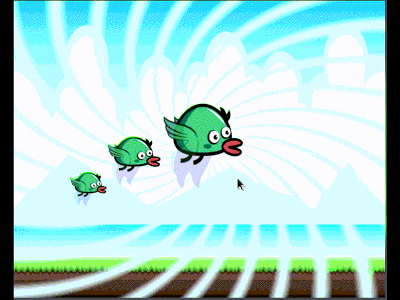
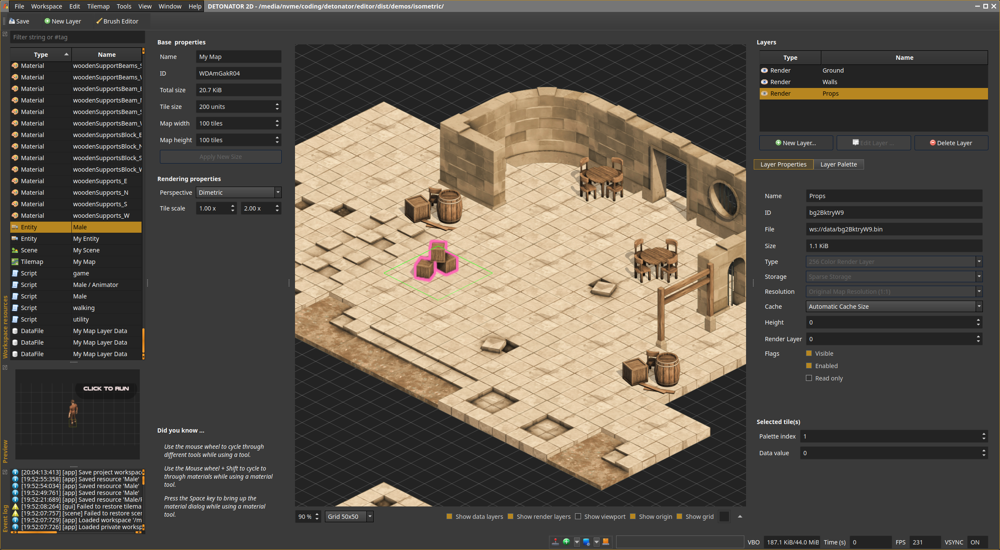
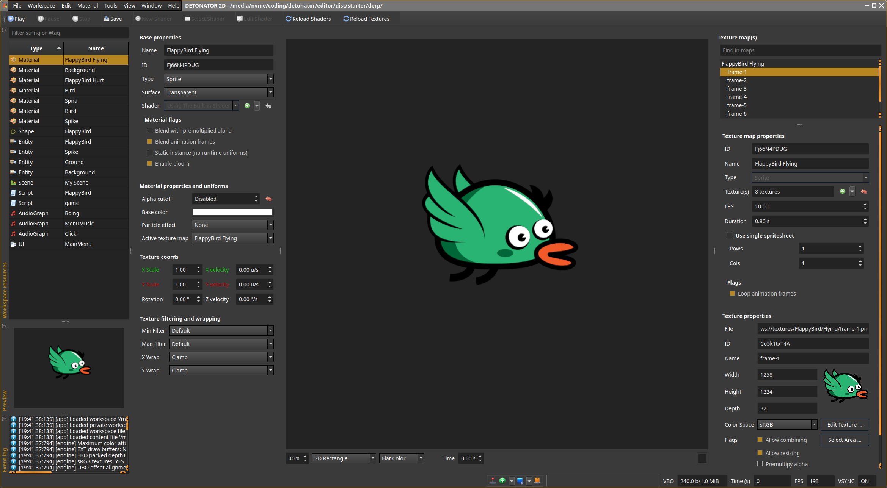
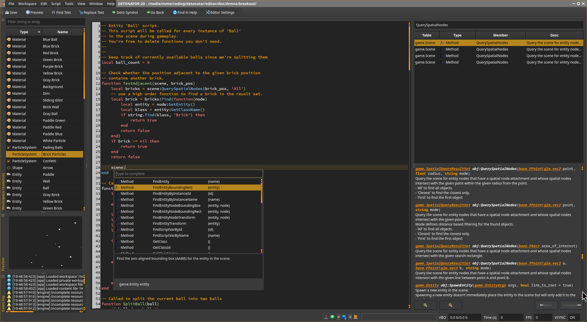
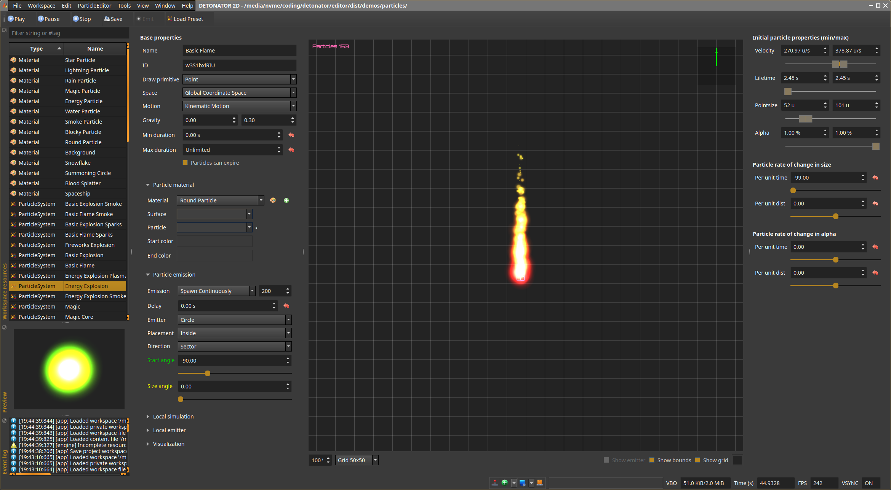

DETONATOR 2D 💥💣
===================
An OpenGL ES based 2D game engine and editor for Linux, Windows and HTML5. Designed for simple single player games such
as puzzle games, platformers, side scrollers and tile based real time strategy and tactics.  🍄🧩🗺️

  

This readme and other readme files, are for developers and cover information related to developing and building the engine itself.
For end user guide see  [help](editor/dist/help/help.html "user help") instead. 

This project would not be possible without the following 🙏 
* Qt, GLM, Freetype, Harfbuzz, Lua, sol3, STB, nlohmann/json, mpg123, libsndfile, Box2D, Emscripten and many others!
* Royalty free art from [https://opengameart.com](https://opengameart.com "https://opengameart.com") 

Other (subsystem) readmes:

  * [Audio](audio/README.md "Audio readme") 🎼
  * [Graphics](graphics/README.md "Graphics readme") (todo)
  * [Game](game/README.md "Game readme") (todo) 👾
  * [Engine](engine/README.md "Engine readme") (todo)
  * [UI](uikit/README.md "UIKit readme") 
  * [WDK](https://github.com/ensisoft/wdk/blob/master/README.md "WDK readme") 

Currently, supported major features:
* Qt5 based WYSIWYG editor
* Text rendering (vector and bitmap)
* Various primitive shapes, custom polygon shapes
* Material system with built-in materials and with custom shaders
* Particle system with projectile and linear motion
* Entity system with animation tracks
* Audio engine with approx. dozen audio elements
* Lua based scripting for entities, scenes and UIs
* Built-in Lua script editor with code formatting, API help and code completion
* Scene builder
* Styleable UI system (JSON style files *and* material system integration) 
* Physics engine based on Box2D
* Demo content and starter content
* Game content packaging for native and HTML5/WASM (with Emscripten)
* Resource archives, export and import between projects (in zip)
* Tilemap importer, several handy dialogs for materials, fonts, colors etc.
* Several other tools such as:
  * Image packer (for packing textures manually when needed)
  * Bitmap font mapper (map glyps to characters and vice versa)
  * SVG viewer and PNG exporter
  * VCS (Git) integration for syncing project changes to Git

Currently, not yet 100% complete major features:
* Continued work on tilemaps 
  * Lua APIs for data access etc.
  * Related algorithms such as path finding
  * Compression etc. performance improvements
  * Rendering performance improvements and fixes
  * Isometric tilemap integration wtih scene+entity system

Planned major features not yet implemented:
* Partial 3D support for specific objects (think objects such as coins, diamonds, player ship etc.)
* OpenGL ES3 backend and WebGL2 support
* Android support (TBD)
* Mobile web + touch screen support 
* Post-processing effects such as bloom, custom render passes
* Vector fields, fluid sims, more elaborate particle effects
* Plenty of asset baking features
* Acceleration structures for game subsystems such as physics and rendering
  
Planned minor features not yet implemented:
* See issues for more details

Create tile based maps using the tile editor. The map supports multiple layers and both isometric and axis aligned perspective.
The map can then be combined with the scene and the scene based entities to produce the final game world.

Create animated game play characters in the entity editor. Each entity can contain an arbitrary render tree
of nodes with various attachments for physics, rendering, text display etc. The entity system supports scriptable
animation state graph as well as animation tracks for managing animation and entity state over time.
Each entity type can then be associated with a Lua script where you can write your entity specific game play code.

Create materials using the material editor by setting some properties for the provided default material shaders.
Currently, supports sprite animations, textures (including text and noise), gradient and color fills out of box.
Custom shaders can be used too.

Create the game play scenes using the scene editor. The entities you create in the entity editor are available here
for placing in the scene. Viewport visualization will quickly show you how much of the game world will be seen when
the game plays.

Create the game's UI in the UI editor. The UI and the widgets can be styled using a JSON based style file and then individual widgets
can have their style properties fine-tuned in the editor. The style system integrates with the editor's material system too!

Create audio graphs using the audio editor. Each audio graph can have a number of elements added to it. The graph then
specifies the flow of audio PCM data from source elements to processing elements to finally to the graph output. 
Currently, supported audio backends are Waveout on Windows, Pulseaudio on Linux and OpenAL on HTML5/WASM. 
Supported formats are wav, mp3, ogg and flac.

Use the built-in code editor to write the Lua scripts for the entities, scenes, game or UI. The editor has a built-in
help system for accessing the engine side Lua API documentation as well as automatic Lua code formatting and linting and
a code completion system! 

Create different types of particle effects in the particle editor by onveniently by adjusting several sliders 
and knobs that control the particle effect. 

## Getting Started

### [Build Instructions](BUILDING.md)

## Detailed Documentation

### [System Architecture](ARCHITECTURE.md)
### [Coding Convetion & Design](DESIGN.md)
### [Tracing & Profiling](PROFILING.md)

