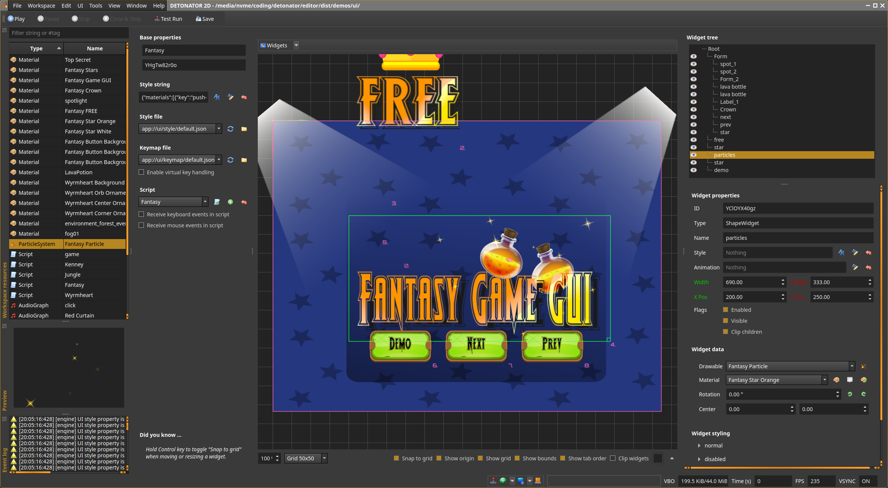
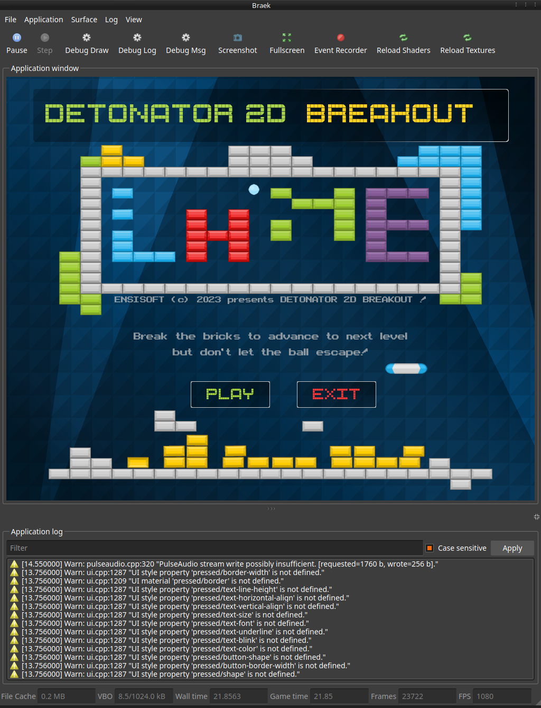

GAMESTUDIO 2D
===================

A 2D game engine and editor for Linux, Windows and HTML5. Designed for simple single player games such as puzzle games,
platformers and side scrollers. Eventually support is planned for tile based games too for real time strategy/tactics.

This readme and other readme files, are for developers and cover information related to developing and building the engine itself.<br>
For end user guide see  [help](editor/dist/help/help.html "user help") instead. 

Other readmes:
  * [Audio](audio/README.md "Audio readme")
  * [Graphics](graphics/README.md "Graphics readme") (todo)
  * [Game](game/README.md "Game readme") (todo)
  * [Engine](engine/README.md "Engine readme") (todo)
  * [UI](uikit/README.md "UIKit readme") 
  * [WDK](wdk/README.md "WDK readme")


Currently supported major features:
* Qt5 based editor
* Text rendering
* Various primitive shapes, custom polygon shapes
* Material system
* Particle system
* Entity system with animation tracks
* Audio engine
* Lua based scripting for entities, scenes and game logic
* Scene builder
* Styleable UI system 
* Box2D based physics
* Demo content
* Game content packaging
* Window integration (https://github.com/ensisoft/wdk)
* HTML5/WASM build target support

Planned major features not yet implemented:
* tile maps and tile engine
* partial 3D support for specific objects (think objects such as coins, diamonds, player ship etc.)
* OpenGL ES3 backend, WebGL2

Planned minor features not yet implemented:
* See issues for more details


Create your animated game play characters in the entity editor. Each entity can contain an arbitrary render tree
of nodes with various attachments for physics, rendering and text display. Animation tracks allow changing the properties
of the nodes and transforming the tree itself over time. Each entity type can then be associated with a Lua script where
you can write your entity specific game play code.


Create materials using the material editor by setting some properties for the provided default material shaders.
Currently supports sprite animations, textures (including text and noise), gradient and color fills out of box.
Custom shaders can be used too.


Create the game play scenes using the scene editor. The entities you create in the entity editor are available here
for placing in the scene. Viewport visualization will quickly show you how much of the game world will be seen when
the game plays.


Create the game's UI in the UI editor. The UI and the widgets can be styled using a JSON based style file and then individual widgets
can have their style properties fine tuned in the editor. The style system integrates with the editor's material system too!


Create audio graphs using the audio editor. Each audio graph can have a number of elements added to it. The graph then
specifies the flow of audio PCM data from source elements to processing elements to finally to the graph output. Currently
supported audio backends are Waveout on Windows and Pulseaudio on Linux. Supported formats are wav, mp3, ogg and flac.


Use the built-in code editor to write the Lua scripts for the entities, scenes or for the game. The editor has a built-in
help system for accessing the engine side Lua API documentation.


During the development the game is available for play in the editor. It's possible to do live edits to the
game content in the editor and see the changes take place in the play window.

Build Instructions
==================

WASM
------------------------------
Building to WASM currently supported only for the engine but not the editor.
The build is separated from the main engine build and is in emscripten/ folder.

- Install emscripten (https://emscripten.org/docs/getting_started/downloads.html) Note that the
  location of emsdk is arbitrary, but I've dumped it into gamestudio/ so that my IDE (Clion) can
  easily find the emscripten headers for C++ tooling (the CMakeLists then has a matching include for this).
- Currently, the target Emscripten version is 3.0.0. Using other version will likely break things.
- If using Windows Install Ninja from https://github.com/ninja-build/ninja/releases. Drop the ninja.exe for example
  into the emsdk folder or anywhere on your PATH.

On Linux

- Install Emscripten
```
  $ cd gamestudio
  $ git clone https://github.com/emscripten-core/emsdk.git
  $ cd emsdk
  $ git pull
  $ ./emsdk install latest
  $ ./emsdk activate 3.0.0
  $ source ./emsdk_env.sh
```
-- Check your Emscripten installation
```
  $ which emcc
  $ /home/user/emsdk/upstream/emscripten/emcc
  $ emcc --version
  $ emcc (Emscripten gcc/clang-like replacement + linker emulating GNU ld) 3.0.0 (3fd52e107187b8a169bb04a02b9f982c8a075205)
```
- Build the Gamestudio engine into a WASM blob. Make sure that you have the emscripten tools in your path,
  i.e. you have sourced emsdk_env.sh in your current shell.
```
  $ git clone https://github.com/ensisoft/gamestudio
  $ cd gamestudio
  $ git submodule update --init --recursive
  $ cd emscripten
  $ mkdir build
  $ cd build
  $ emcmake cmake .. -DCMAKE_BUILD_TYPE=Release
  $ make -j16 install
``` 

On Windows
- Install Emscripten
```
  $ cd gamestudio
  $ git clone https://github.com/emscripten-core/emsdk.git
  $ cd emsdk
  $ git pull
  $ emsdk.bat install latest
  $ emsdk.bat activate 3.0.0
  $ emsdk_env.bat
```
-- Check your Emscripten and Ninja installation
```
  $ where emcc
  $ C:\coding\gamestudio\emsdk\upstream\emscripten\emcc
  $ C:\coding\gamestudio\emsdk\upstream\emscripten\emcc.bat
  $ emcc --version
  $ emcc (Emscripten gcc/clang-like replacement + linker emulating GNU ld) 3.0.0 (3fd52e107187b8a169bb04a02b9f982c8a075205)
  $ where ninja
  $ C:\coding\gamestudio\emsdk\ninja.exe
  $ ninja --version
  $ 1.10.2
```
- Build the Gamestudio engine into a WASM blob. Make sure you have emcc and ninja in your path i.e. you have
  ran emsdk_env.bat in your current shell. 
```
  $ git clone https://github.com/ensisoft/gamestudio
  $ cd gamestudio
  $ git submodule update --init --recursive
  $ cd emscripten
  $ mkdir build
  $ cd build
  $ emcmake cmake .. 
  $ ninja -j8
  $ ninja -j8 install
```

If everything went well there should now be GameEngine.js and GameEngine.wasm files in the editor's dist folder. 
The .js file contains the JavaScript glue code needed to manhandle the WASM code into the browser's WASM engine
when the web page loads. When a game is packaged for web these files will then be deployed (copied) into the
game's output directory.

Penguin Juice (Linux)
------------------------------

- Install the dev packages.
  (for Ubuntu based systems)
```
  $ sudo apt-get install libboost-dev
  $ sudo apt-get install qtbase5-dev
  $ sudo apt-get install libpulse-dev
```
- Install Conan build system.
https://docs.conan.io/en/latest/installation.html

$ conan profile new default --detect

If conan bitches about "ERROR: invalid setting" (for example when GCC major version changes)
you can try edit ~/.conan/settings.yaml 

- Build the project in RELEASE mode
```
  $ git clone https://github.com/ensisoft/gamestudio
  $ cd gamestudio
  $ git submodule update --init --recursive
  $ mkdir build
  $ cd build
  $ conan install .. --build missing
  $ cmake -G "Unix Makefiles" .. -DCMAKE_BUILD_TYPE=Release
  $ make -j16 install
  $ ctest -j16
```

- Build the project in DEBUG mode
```
  $ git clone https://github.com/ensisoft/gamestudio
  $ cd gamestudio
  $ git submodule update --init --recursive
  $ mkdir build_d
  $ cd build_d
  $ conan install .. --build missing
  $ cmake -G "Unix Makefiles" .. -DCMAKE_BUILD_TYPE=Debug
  $ make -j16 install
  $ ctest -j16
```

- Build the project for profiling using valgrind / kcachegrind
```
  $ git clone https://github.com/ensisoft/gamestudio
  $ cd gamestudio 
  $ git submodule update --init --recursive
  $ mkdir build_profile
  $ cd build_profile
  $ conan install .. --build missing 
  $ cmake -G "Unix Makefiles" .. -DCMAKE_BUILD_TYPE=RelWithDebInfo
  $ make -j16 install
```
Then in order to profile and analyze the output use the combination of valgrind and kcachegrind.
For example:
```
  $ cd gamestudio/audio/test/
  $ valgrind --tool=cachegrind ./audio_test --graph
  $ kcaghegrind cachegrind.out.XXXXX
```

Instructions for build using Ninja, Clang and Mold linker (optional)
```
  $ export CC=/usr/bin/clang
  $ export CXX=/usr/bin/clang++
  $ conan profile new gamestudio-clang --detect
  
  $ git clone https://github.com/ensisoft/gamestudio
  $ cd gamestudio
  $ git submodule update --init --recursive
  $ mkdir build
  $ cd build
  $ conan install .. --build missing --profile gamestudio-clang
  $ cmake -G "Ninja" .. -DCMAKE_BUILD_TYPE=Release -DUSE_MOLD_LINKER=ON 
  $ ninja -j16 install
```


Boring But Stable (Windows)
---------------------------------

These build instructions are for MSVS 2019 Community Edition and for 64bit build.

- Install Microsoft Visual Studio 2019 Community
https://www.visualstudio.com/downloads/

- Install prebuilt Qt 5.15.2
http://download.qt.io/official_releases/qt/5.15/5.15.2/single/qt-everywhere-src-5.15.2.zip

- Install prebuilt Boost 1.72
https://sourceforge.net/projects/boost/files/boost-binaries/1.72.0_b1/

- Install conan package manager
https://docs.conan.io/en/latest/installation.html

- Open "Developer Command Prompt for VS 2019"

Build the project in RELEASE mode.

```
  $ git clone https://github.com/ensisoft/gamestudio
  $ cd gamestudio
  $ git submodule update --init --recursive
  $ mkdir build
  $ cd build
  $ conan install .. --build missing
  $ cmake -G "Visual Studio 16 2019" -DCMAKE_BUILD_TYPE=Release ..
  $ cmake --build   . --config Release
  $ cmake --install . --config Release
```

Build the project in DEBUG mode. 

* Note that on MSVS the library interfaces change between debug/release build configs. (e.g. iterator debug levels). 
This means that in order to link to 3rd party libraries the debug versions of those libraries must be used.

```
  $ git clone https://github.com/ensisoft/gamestudio
  $ cd gamestudio
  $ git submodule update --init --recursive
  $ mkdir build_d
  $ cd build_d
  $ conan install .. --build missing -s build_type=Debug
  $ cmake -G "Visual Studio 16 2019" -DCMAKE_BUILD_TYPE=Debug ..
  $ cmake --build   . --config Debug
  $ cmake --install . --config Debug
```


The Boring Documentation
=======================

Workflow and getting started
----------------------------
Going from a git clone to a running game is known as the "build workflow". This involves various steps
involving the source tree of the engine, the source tree of the game, the runtime assets provided with the
engine and the runtime assets that are part of the game. Overall this will involve several build and packaging steps.

Currently, only Lua based games are supported. There's a provided game engine that is built into a shared library
and which contains all the relevant functionality for running a game. That is it will take care of rendering the scene,
ticking the physics engine, handling the UI input as well as invoking the Lua scripts in order to run *your* game code.
It's possible to also not use this provided engine but write a completely different engine. In this case the interface
to implement is the "Engine" interface in engine/main/interface.h.

From source code to a running game:
1. Build the whole project as outlined in the **Build Instructions** previously.
   You will also need to *install* the build targets. Installing not only copies the binaries into the right place
   but also copies other assets such as GLSL shader files. Without the install step things will not work correctly!
2. After building launch the Editor from the editor/dist folder.
3. *In the Editor:* Open your game's workspace folder. This is the folder that contains the workspace.json and content.json files.
   In Gamestudio this is essentially your "project" (It's simply a folder with those two specific files in it).
4. *In the Editor:* Package your content. (Workspace|Package). Select the assets you want to package (most likely everything).
   When the packaging process is complete your selected output directory will contain the following:
   1. The game resources copied over, i.e. shaders, textures, font files etc.
   2. A content.json file that contains the resource descriptions for your assets that you've built in the editor
   3. A config.json file that contains the settings for the GameMain to launch the game
   4. A "GameMain" executable and engine library.  These are the default game studio binaries for running your
      game content after the project has been packaged.
5. After packaging launch your game by running the GameMain executable in the package output directory.


System Architecture
-------------------


An overview of the runtime architecture:

1. There's a standard game engine that is built into a shared library called GameEngine.dll or libGameEngine.so.
2. A launcher application called GameMain will read a config.json file. The JSON file contains information about
   windowing, context creation etc.
   1. The launcher application will load the engine library and create an <Engine> object instance.
   2. The launcher application will create the native window system window and also create the Open GL rendering context
      which it will then give to the engine instance.
3. The launcher application will then enter the top-level game loop. Inside the loop it will:
   1. Process any window system window events to handle pending keyboard/mouse etc. events and pass them to the engine as needed.
   2. Handle events coming from the engine instance. These could be for example requests to toggle full screen mode.
   3. Accumulate and track time, call functions to Update, Tick and Draw the app instance.

Inside the game engine the following will take place.
1. The various subsystems are updated and ticked. These include physics, audio, scripting etc.
2. The renderer is used to draw the current scene.
3. The engine will handle the input events (mouse, keyboard) coming from the host process and choose the appropriate action.
   For example If a UI is being shown the input is passed to the UI subsystem. The inputs are then also passed to the
   game scripting system and ultimately to your game's Lua scripts.
4. The engine will handle the incoming events/requests from the game itself. For example the game might request a scene
   to be loaded or the game to be paused.

Running (Unit) Tests
--------------------
There'a bunch of unit tests that are built as part of the normal build process. Basically anything that begins with
a "*unit_test_*" is a unit test. There's a very simple testing utility that is available in base. [test_minimal.h](base/test_minimal.h)  
In order to run tests after a successful build:

```
  $ cd gamestudio/build
  $ ctest -j16
```
Currently, the expectation is that all cases should pass on Linux. On Windows some of the tests are unfortunately broken.
In addition to having the unit tests both the audio and graphics subsystems also have "rendering" tests, i.e. playing audio
or rendering stuff on the screen. The audio systems do not have any automation for checking for correctness. The graphics tests
work based on a set of *gold images*. The images are provided as part of this repository but there's the problem that because
of the differences in OpenGL implementations it's possible that the rendering output is not exactly the same between various
vendors/implementations (such as NVIDIA, AMD, Intel etc.) This needs to be enhanced so that a set of gold images could be
tagged with a vendor tag and multiple gold images per test could exist. (This is a todo for later)

It's also possible to run the audio/graphics tests separately.


Runs, mp3, ogg, flag and 24bit .wav test. Use --help for more information.
```
  $ cd gamestudio/audio/test
  $ ./audio_test --mp3 --ogg --flac --24bit
  $ ...
  $ ./audio_test --help
```

Runs all tests with MSAA4. Any test rendering that differs from the expected gold image will stop the program for user input
(press any key to continue) and will generate a *Delta_* and *Result_* images. The former will help visualize the pixels 
that were not the same between result and gold and the result will be actual rendering result in whole. 
Use --help for more information.
```
  $ cd gamestudio/graphics/test/dist
  $ ./graphics_test --test --msaa4
  $ ...
  $ ./graphics_test --help 
```

Coding Convention & Design
--------------------------
- todo: c++ objects that represent classes
- todo: asserts/logging/exceptions
- todo: callbacks

Tracing & Profiling
-------------------
What follows is only specific to Linux. I don't know the tools for doing this on Windows.

The engine has very primitive tracing built in. Most of the top-level subsystem calls to update all subsystems and to render
the scene are wrapped inside trace calls. (The macros and tracing facilities can be found in base/trace.h) 
```
  TRACE_CALL("Renderer::BeginFrame", mRenderer.BeginFrame());
  TRACE_CALL("Renderer::DrawScene", mRenderer.Draw(*mScene , *mPainter , transform, nullptr, &cull));
```

The tracing can be turned on in the GameMain application by providing --trace parameter with a name to the file
where to record the trace. There are 2 formats that are supported. A simple text format and a JSON format that is
compatible with Chromium's trace viewer. So for example to trace blast demo one first needs to build the release
package of the game (in GSEditor) and then navigate to the that directory and launch the game.

```
 $ ./Blast\! --trace trace.json
```

This should produce a trace.json file which can be loaded in Chrome/Chromium. 
(Open a new tab and open about::tracing and hit the Load button)

The top most bar of every frame (MainLoop) is the overall frame trace and should not exceed your swap interval.
In other words if you're running with VSYNC turned on (see your game's config.json) this should not exceed your 
maximum frame time which is computed as 1.0 / hz. (Where hz is your display's refresh frequency).
In any frame *most* of the time should be spent in Device::Swap given the computational capacity of a modern
computer and GPU and the simplicity of the games in this package.

Overall all frames are composed of the following sequence:
1. Begin new game loop iteration
    1. Call engine begin loop
        1. Call "begin loop" on all engine subsystems
2. Handle events
   1. Handle window system window events
   2. Handle engine requests  
3. Update engine
   1. All subsystems update
   2. All subsystems tick (if needed) 
4. Draw
   1. Renderer draw scene
   2. Physics draw debug 
   3. UI paint UI
   4. Draw engine aux stuff, debug messages, mouse
4. Swap
5. End game loop iteration
   1. Call engine end loop
       1. Call "end loop" on all subsystems
       


The tracing allows to quickly get an overview of the frame structure and find out where the frame time is spent. This is ideal
for quickly seeing the janky frames and getting some idea what's going on. The hard problem will be then figuring out
more details of the part that is going wrong. One option is to pepper the code with more trace macros. The alternative
is to use a profiler such as valgrind.

*Valgrind + callgrind + kcachegrind*

The biggest problem with valgrind is that it cannot be used for the entire application. It'll be far too slow and the
game will not be able to run properly. Instead, the profiling needs to be turned on and off only for parts of the code.

I've experimented with writing little snippets like.

```
#include <valgrind/callgrind.h>

...

if (some_condition)
{
  CALLGRIND_START_INSTRUMENTATION;
  profiling = true;
}

// do the actual stuff

if (profiling)
{
  CALLGRIND_STOP_INSTRUMENTATION;
}
```
This isn't the simplest way to do to it and requires having to rebuild the game engine but definitely allows for the
most fine-grained control as-to when to capture the profiling information and can limit the instrumentation to a scope that
is actually manageable and keeps the game still in a runnable state. 
Then in order to run game with the profiler do:

```
  $ valgrind --tool=callgrind --instr-atstart=no ./Blast\!
```

Once the tracing and profiling has ended use kcachegrind to open the callgrind chart.

```
  $ kcachegrind callgrind.out.xxxx
```


https://valgrind.org/docs/manual/cl-manual.html#cl-manual.basics