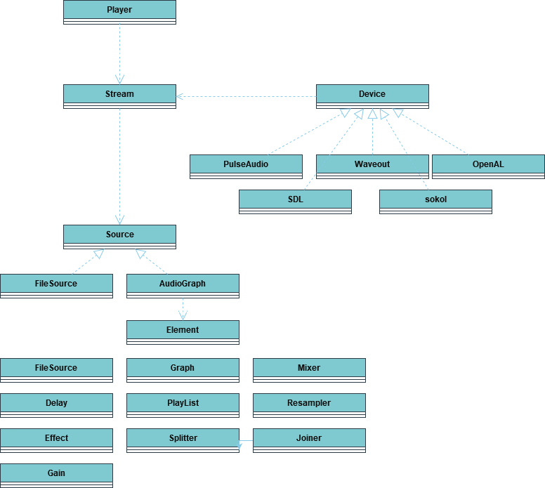

DETONATOR 2D 💥💣
===============

Audio Library 🎼
---------------------
The audio library is divided into following core components that take part in playing audio.

* Device 
   - An abstract interface for accessing some underlying platform API for playing audio.
   - Current implementations include PulseAudio, Waveout, OpenAL and pseudo backends sokol and SDL.
      - Sokol and SDL are pseudo backends that use lower level platform APIs. 
      - Sokol is currently used to provide WebAudio support on WASM/HTML5.
      - Pulseaudio is used on native Linux.
      - Waveout is used on native Windows.
      - OpenAL and SDL are currently not being used.
* Player
  - Handles the high level audio track management and uses a device object for the audio playback. 
  - Supports running a native audio thread for audio playback. (Compile time configuration).
  - Maintains a list of current audio streams either playing, paused or pending on some action.
* Source
  - A low level source object for filling audio buffers with PCM data.
  - Typical implementations either generate the data or use a decoder to decode an audio file.
    - An AudioGraph source runs an audio graph consisting of audio elements in order to generate PCM data. 
* Stream
  - Device specific audio playback stream with some stream state and a Source object.
  - Exists only inside the device and is not accessible from outside the device during playback.
  - Combines playback state with the actual audio data source.
* Element 
  - Basic building block for building audio graphs. 
    - Non-source elements receive audio data in a PCM buffer in their input port(s) and 
      provide outgoing data in their output port(s) after audio procesing.
    - Source elements generate the initial audio data buffers by for example decoding an audio file.
* Port 
  - Audio element connection point.
  - Audio elements are connected by creating a connection (link) between one audio element's output port and another
    element's input port.


    
Overview of the basic steps needed to play audio:
1. Create an audio device through *audio::Device::Create* 
2. Use the device to create an *audio::Player*
3. Create an audio *Source* object
4. Call *Player::Play* and pass the source as a parameter. The return value will be a "handle" to the stream in the player.
   1. The audio player will take ownership of the source
   2. The player will use the device to create a playback *Stream* object
   3. The player will store the stream in an internal "currently playing" track list
   4. The player will observe the stream for state changes, manage its playback and fill PCM buffers 
      1. *Source::HasMore* is used to check whether the *Source* has more PCM data or not.
      2. *Source::FillBuffer* is used to provide PCM data to underlying audio device
5. Periodically call *audio::Player::GetEvent* to receive *SourceCompleteEvent* information regarding the 
   completion of some audio playback. 
6. (Optional) call *Player::Pause*, *Player::Resume* or *Player::Cancel* to manage the audio playback. 

Currently supported PCM formats:
* Mono or stereo
* 16bit integer (Pulseaudio/Waveout/OpenAL/SDL) 
* 32bit integer (Pulseaudio/Waveout/SDL)
* 32bit floating point (All backends)
* Various sample rates from 8k to 96k (depending on the underlying audio device support)
* Recommended format is 41k Hz 32bit float

Audio Graphs 🤔
-------------
The goal is to be able to create an audio system that can be used to not only playback simple audio files but to also
add/create various audio effects (such as echo, delay etc.) in realtime during the said playback.

The graph consists of the following:
* Audio elements
  - Have any number of input/output ports for receiving (input) and providing (output) PCM audio buffers
    - Each port has an associated PCM format that it supports.   
  - Source elements have 0 input buffers and either generate (read a file) PCM data for the rest of elements.
  - Other elements receive PCM data through their input port(s), perform signal processing on it and push their
    output data into their output ports.
- Audio links
  - The connections between elements' ports'.
  - A single audio link connects element A's output port to element B's input port. 

When the graph evaluates the elements are evaluated in a topological order. Any output buffer(s) from a preceding 
element is/are *pulled* from its output port(s) and *pushed* into the receiving/subsequent element's input port(s). 
Then the subsequent element is evaluated. This process repeats as long as there are more elements in the topological 
list of elements to evaluate. The graph is assumed to form a DAG  (https://en.wikipedia.org/wiki/Directed_acyclic_graph)
and may NOT contain any cycles. 

All elements in the audio graph must have a compatible format. The format negotiation happens when
the graph is prepared before any evaluation begins. The format is then set on the ports and subsequently
the audio buffers are then stamped with current data format.
If an element doesn't support the incoming data format a conversion element, such as Resampler, StereoSplitter/Joiner
must be placed in between in order to make the data compatible.

<i>Note that the so-called *source* (such as *FileSource*) elements do not have any 
input ports and cannot be used to receive any data. They can only be used to generate/provide data for the rest of the
elements in the graph.</i>

<i>
The *AudioGraph* class implements the *Source* interface and can be sent to the *Player* for playback.</i>

See [elements](element.h) for a complete list of audio elements.

Setting up audio graph code example:
```
// Create new audio graph 
auto graph = std::make_unique<audio::AudioGraph>("graph");

// Setup the audio format used by the SineSource audio source element.
audio::Format sine_format;
sine_format.sample_type   = audio::SampleType::Float32;
sine_format.channel_count = 1;
sine_format.sample_rate   = 44100;

// Create and add audio elements to the audio graph
(*graph)->AddElement(audio::SineSource("sine", sine_format, 500, 5000));
(*graph)->AddElement(audio::FileSource("file", "OGG/testshort.ogg",audio::SampleType::Float32));
(*graph)->AddElement(audio::Gain("gain", 1.0f));
(*graph)->AddElement(audio::Mixer("mixer", 2));
(*graph)->AddElement(audio::StereoSplitter("split"));
(*graph)->AddElement(audio::Null("null"));

// Create audio links for PCM data flow from one element
// to another element.
(*graph)->LinkElements("file", "out", "split", "in");
(*graph)->LinkElements("split", "left", "mixer", "in0");
(*graph)->LinkElements("split", "right", "null", "in");
(*graph)->LinkElements("sine", "out", "mixer", "in1");
(*graph)->LinkElements("mixer", "out", "gain", "in");

// Select the element for the final graph outpu 
(*graph)->LinkGraph("gain", "out");

// Produces the following graph

       (mono channel)
Sine ==================> 
                         Mixer ==> Gain ==> out
                 (L) ===> 
File ===> Splitter 
                 (R) ===> Null   
```        

Third Party Libs 📚
-------------------
Audio system depends on the following 3rd party libraries:
* libsndfile
  - Used to decode .flac, .ogg (vorbis) and .wav files
  - https://libsndfile.github.io/libsndfile/
* mpg123
  - Used to decode .mp3 files
  - http://www.mpg123.de
* libsamplerate
  - Used to do sample rate conversions on the fly when needed
  - http://libsndfile.github.io/libsamplerate/
* SDL
  - Cross-platform system library including audio support.
  - Unresolved issues in WASM so currently not in production use.
  - https://www.libsdl.org/
* Floooh/SOKOL audio
  - Minimal single header audio library 
  - Currently, used to provide WebAudio access in WASM/HTMl5 environment
  - https://github.com/floooh/sokol/blob/master/sokol_audio.h