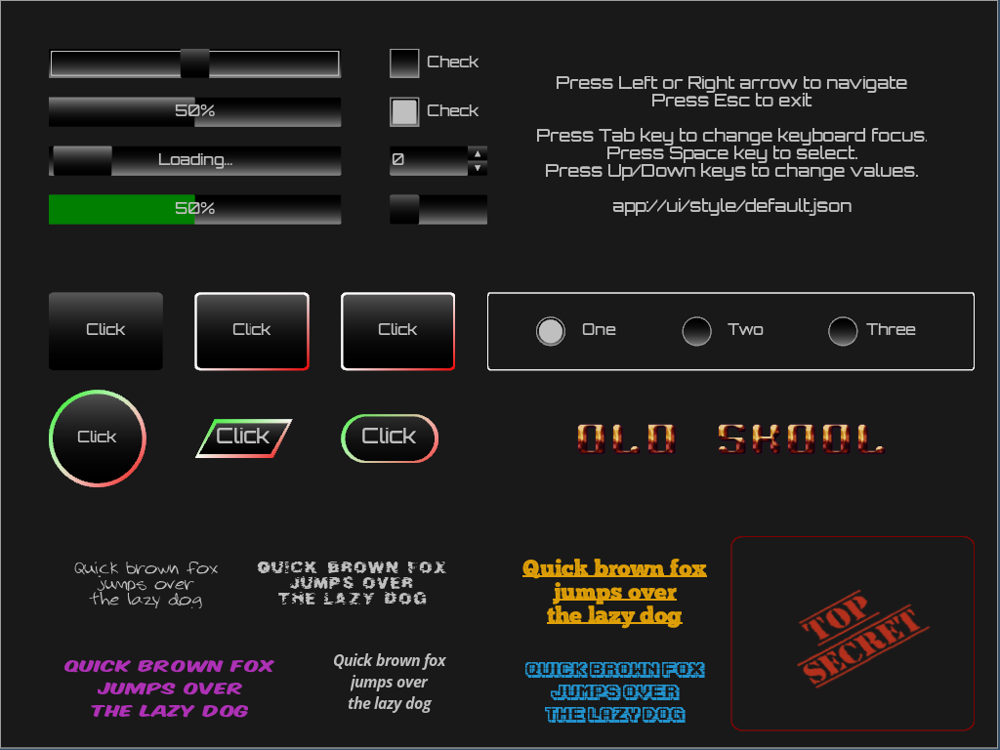
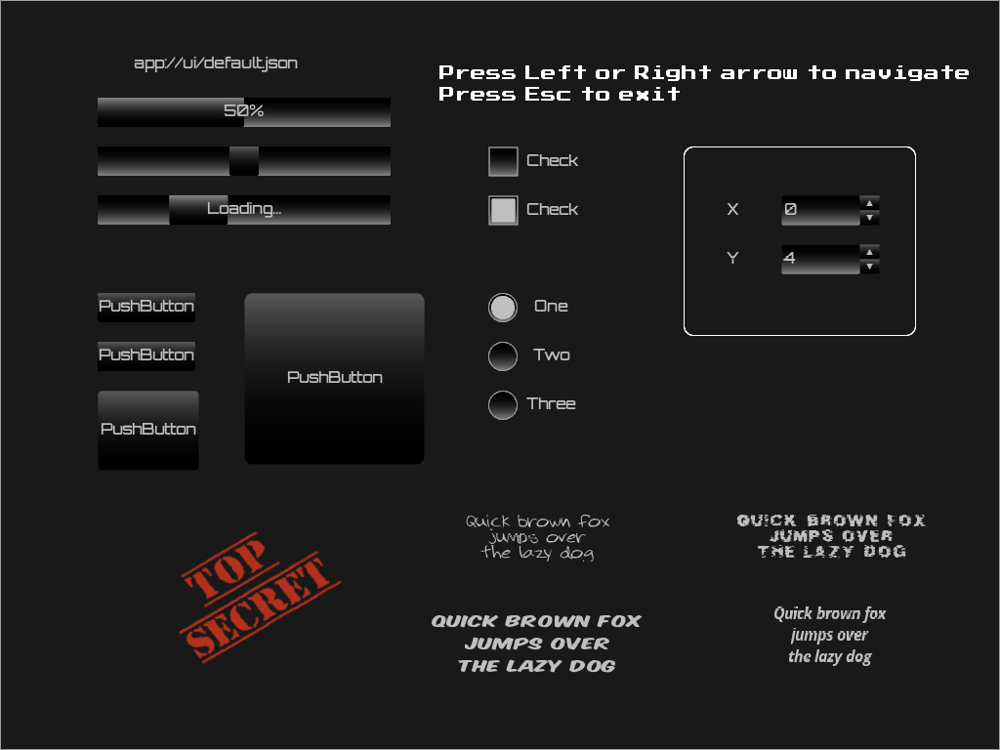
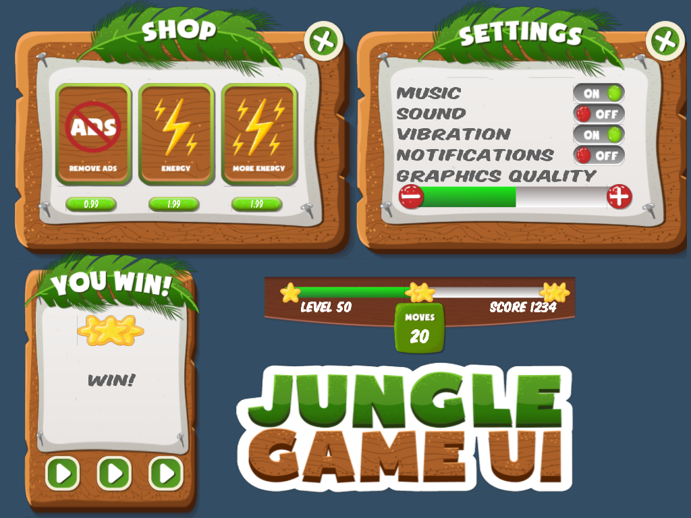
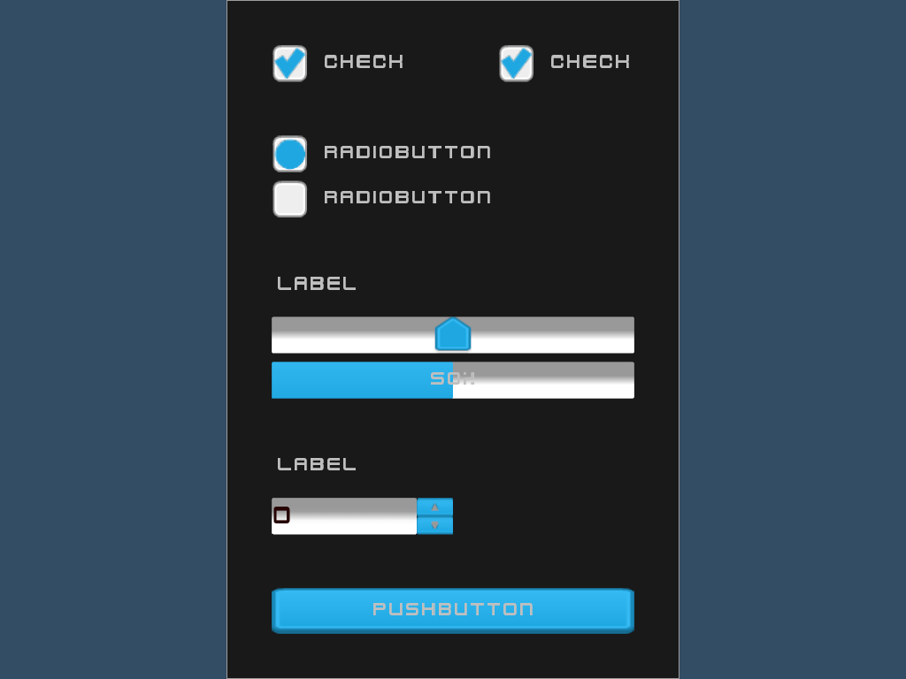
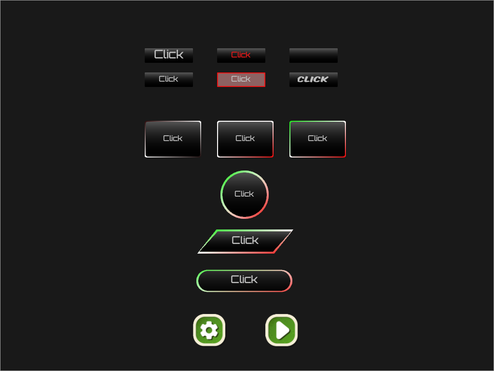

GAMESTUDIO UI
=================


UI layered on top of a scene

Overview
-----------------
Skinnable/styleable UI system that integrates with the editor's material system
for fine-tuning the look of individual widgets. Styling is based on key/value 
property pairs that are stored in a JSON file, as an inline style string (if any)
in the window object and as inline style strings (if any) per each widget.

Style file example:

```
   "properties": [
       {
          "key": "widget/edit-text-font",
          "value": "app://fonts/orbitron-medium.otf"
        }
        , ....
    ],
    "materials": [
        {
            "key": "slider/mouse-over/slider-knob",
            "type": "Gradient",
            "color0": "LightGray",
            "color1": "LightGray",
            "color2": "Black",
            "color3": "Black",
            "gamma": 2.2
        }, ....
    ]        
```

The UI system is completely abstract and doesn't do any rendering directly.
Instead, the widgets delegate their drawing operations to an abstract painter object
that can be implemented independently. One such implementation can be found under engine.

Both mouse and keyboard input are supported. The keyboard input is based on virtual keys
that can be generated in several possible ways. One typical way however is by using a 
virtual keyboard map, which maps "native" keyboard events (such as those provided by WDK)
to virtual keys recognized by the uikit. 

Currently, the following widgets have been implemented.
* Form
  - Container widget for other widgets. Renders an optional border and a background.
* GroupBox
  - Container widget for other widgets. Renders an optional border and a background.
* Label
  - Widget that displays static text.
* ProgressBar 
  - Widget that displays progress between 0-100%. 
  - Can also be a "spinner"/busy indicator without any actual progress value.
* Slider
* PushButton
* RadioButton
* CheckBox
* SpinBox (integer)

TODO:
* Double spinbox
* Dropdown and/or ComboBox
* LineEdit (for text input)
* ListWidget

Screenshots
---------------------
Below are some screenshots demonstrating the capabilities of the skinning system.


Widgets with default style (default.json) and (mostly) without any widget specific inline styling


Form with 4 buttons with custom skinning/styling


Various widgets with custom skinning/styling


Various push buttons with skinning and inline styling