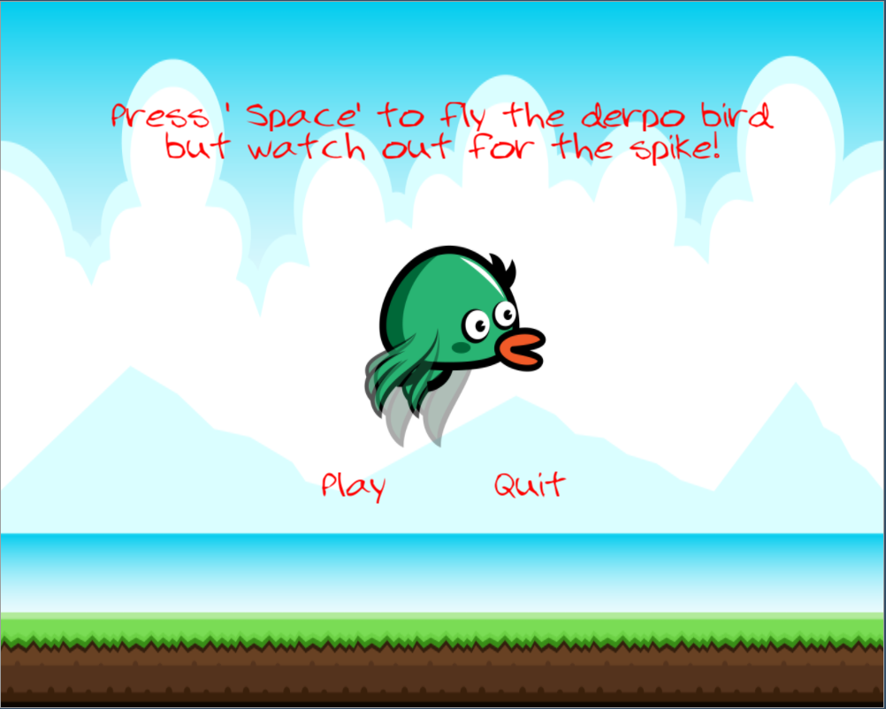

GAMESTUDIO UI
=================


UI layered on top of a scene

Overview
-----------------
Skinnable/styleable UI system that integrates with the editor's material system
for fine-tuning the look of individual widgets. Currently, provides only mouse
based input handling. Keyboard input is in the works. Styling is based on key/value 
property pairs that are stored in a JSON file.

For example:

```
   "properties": [
       {
          "key": "widget/edit-text-font",
          "value": "app://fonts/orbitron-medium.otf"
        }
        , ....
    ],
    "materials": [
        {
            "key": "slider/mouse-over/slider-knob",
            "type": "Gradient",
            "color0": "LightGray",
            "color1": "LightGray",
            "color2": "Black",
            "color3": "Black",
            "gamma": 2.2
        }, ....
    ]        
```

The UI system is completely abstract and doesn't do any rendering directly.
Instead the widgets delegate their drawing operations to an abstract painter object
that can be implemented independently. One such implementation can be found under engine.

Currently, the following widgets have been implemented.
* Form
  - Container widget for other widgets. Renders an optional border and a background.
* GroupBox
  - Container widget for other widgets. Renders an optional border and a background.
* Label
  - Display static text
* ProgressBar 
  - Display progress between 0-100%. 
  - Can also be a "spinner"/busy indicator without any actual progress value.
* Slider
* PushPutton
* CheckBox
* SpinBox (integer)

TODO:
* Double spinbox
* Dropdown and/or ComboBox
* LineEdit (for text input)
* ListWidget
* Keyboard input handling based on a virtual key system

Screenshots
---------------------


With default style


With custom style
