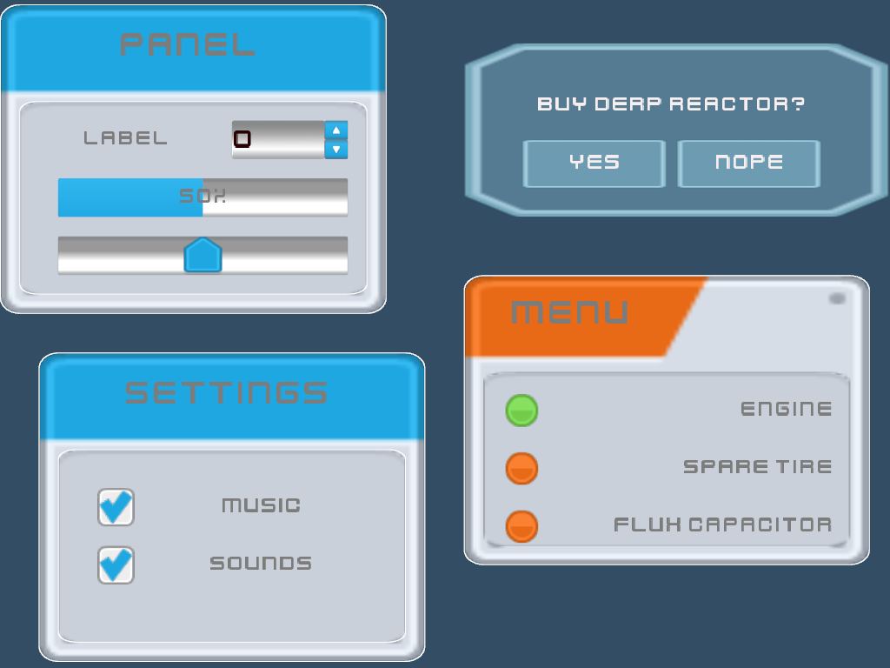

DETONATOR 2D 💥💣
===================

## User Interface Kit (UIK For Short) ##
UIK is a system to create  in-game user interfaces using a retained mode widget model. 
The widgets can be arranged in a hierarchy where container widgets contain other widgets. 
All widgets are then contained inside a window object which provides the "housing" of any
single game UI.

Current features:
* Retained mode keeps the static widget state persistent across UI saves and loads.  The UI editor
  in the DETONATOR 2D editor can be used to place widgets and change their properties effortlessly.
  There's no programming needed to create game UI visuals.
* Scriptable action handling through Lua scripting. Each UI/window class can be associated with a Lua
  script that can execute on various UI related events such as when a widget value changes etc. It's  
  then possible to interface seamlessly with the rest of the game code from the UI script.
* Widget styling is based on JSON style files. Each style file provides material and property definitions
  with specific known keys to style widget and their sub-components. Then each widget can also be
  styled inside the UI editor by adjusting widget specific style properties.
  The styling has complete integration with the material system so that it's possible to use any material
  definition as widget material for things such as backgrounds, borders etc.
* Widget animation through a set of declarative animation rules. It's possible to create simple animations
  such as widget slides, bounces etc. with simple rule based animation system that defines a trigger event
  and any number of animation actions to be taken. The system is inspired by CSS keyframe animation and 
  offers several similar easing curves for quick and simple UI animation.
* Supports both keyboard and mouse input and allows complete control over any key mappings through virtual
  key system. In other words the UI system only reacts to "virtual keys" which can be mapped from physical
  keyboard key events through a key mapper.

Currently, the following widgets have been implemented.
* Form
  * <i>Basic container widget for other widgets</i>
  * <i>Can show optional background / border </i>
* GroupBox
  * <i>Basic container widget for other widgets</i>
  * <i>Can show optional background / border </i>
  * <i>Performs automatic mutual exclusion on radio buttons</i>
* Label
  * <i>Basic widget to show some static text</i> 
* ProgressBar
  * <i>Used to visually indicate "progress" of some kind</i>
  * <i>Can be configured to be an endless "spinner"</i> 
* Slider
  * <i>Used to let the user change a value by dragging a handle</i>
* PushButton
  * <i>Used to let the user perform some action such as "start" or "quit".</i> 
* RadioButton
  * <i>Used to indicate a selection within a group</i>
  * <i>Has automatic single selection (exclusion) between radio buttons inside the same groupbox</i>  
* CheckBox
  * <i>Used to let the user indicate a desired selection</i>
* SpinBox (integer)
  * <i>Used to let the user increment or decrement a value</i>
  * <i>Supports min, max value limit(s)</i>
* ToggleBox
  * <i>Similar to checkbox except animated toggle between on and off states</i> 
* ScrollArea
  * <i>Container widget for other widgets</i>
  * Supports virtual viewport with vertical and horizontal scrolling</i>
* ShapeWidget
  * <i> Widget that renders arbitrary shape (drawable) and material</i>
  * <i> Used to add visual elements to the UI, for example particles</i>
  
TODO widgets:
* Spinbox (float)
* Dropdown and/or ComboBox
* LineEdit (for text input)
* ListWidget 
* Main menu
* Context menu

## Widget Styling

Widget styling relies on key-value pairs that either define a key and a property pair or a key and material pair.

Properties define simple properties for a key, such as float, int, boolean etc values.
Materials either define simple materials such as solid colors, gradients or textures. They can also refer to 
more complex materials defined in the project resources.

<i><b>Key</b></i><br>
The identifier for a specific styling property, similar to CSS selectors, formatted as "component/property" 
(e.g., "push-button/border-width"), which uniquely defines a particular aspect of the component's appearance.

<i><b>Property</b></i><br>
The value assigned to the styling key, defining the specific attribute or characteristic of the component's appearance (e.g., 2.0f for "push-button/border-width")

<details><summary>Style example</summary>

```
   "properties": [
       {
          "key": "widget/edit-text-font",
          "value": "app://fonts/orbitron-medium.otf"
        }
        , ....
    ],
    "materials": [
        {
            "key": "slider/mouse-over/slider-knob",
            "type": "Gradient",
            "color0": "LightGray",
            "color1": "LightGray",
            "color2": "Black",
            "color3": "Black",
            "gamma": 2.2
        }, ....
    ]        
```
</details>

However normally one would not bother with writing style information by hand in JSON format. 
When using the editor a more convenient method is to use the style property editor
that allows easily to change each every property of every widget. The properties can be set on
a single widget or on the window. When set on a single widget the styling applies only
to that widget. When set on the window the styling applies to any widget of that type.


## Widget Animation


<details><summary>Click here to see the source for the above animation</summary>

```
@motion
0%
position 0.0 0.0
25%
position 0.0 300.0
50%
position 300.0 300.0
75%
position 300.0 0.0
100%
position 0,0 0.0

@colors
0%
text-color Red
background-color Bronze
25%
text-color HotPink
background-color Red
50%
text-color Yellow
background-color Green
100%
background-color Blue
text-color Cyan

$OnIdle
animate @motion
animate @colors
duration 1
loops 5
interpolation EaseInOutBounce
idle-for 2.0

```

</details>

There are two types of animations. Timeline and key-frame animations. Both types of animations are event-driven. In
other words they're triggered on some event such as user interaction (user clicking on a button).

<i><b>Timeline Animation</b></i><br> 
This type of animation involves a sequence of actions or changes that are mapped out over a period of time. 
Each action has a specific start time, duration, and set of properties that change. 
It is often represented on a timeline, making it easy to see when each action occurs and how long it lasts.


<i><b>Key-Frame Animation</b></i><br> 
This type of animation involves defining the starting and ending points (key frames) of any smooth transition. 
Key frames are specific points in time where the properties of the animated objects are explicitly set. 
The system interpolates the values between these key frames to create the animation.

<i><b>Key Frames</i></b><br>
Specific points in time where the properties of the animated objects are explicitly set.

<i><b>Interpolation</i></b><br>
The process of calculating intermediate values between key frames to create smooth transitions.

<i><b>Property Changes</i></b><br>
The properties (such as position, rotation, scale, color, etc.) that change over time based on the values defined at the key frames.

<i><b>Control Points</i></b><br>
The key frames act as control points that define the major transitions in the animation, with the system automatically handling the in-between frames.

<i><b>Interpolation Methods</i></b><br>
Easing functions specify the rate of change of a parameter over time to give it more natural movement where the objects velocity is continuously adjusted.
For example an object that is dropped will first accelerate downwards and then bounce upwards after hitting the floor.

<i><b>Event-Driven Animation</b></i><br>
This type of animation is triggered by specific events (such as user interactions, system events,
or other predefined conditions). Each event triggers an action that occurs over a specified duration
and affects certain properties. both <i>Timeline</i> and </i>key frame</i> animations are event driven.


<details><summary>List of Interpolation Methods</summary>

* StepStart
* Step
* StepEnd
* Linear
* Cosine
* SmoothStep
* Acceleration
* Deceleration
* EaseInSine
* EaseOutSine
* EasInQuadratic
* EaseOutQuadratic
* EaseInOutQuadratic
* EaseInCubic
* EaseOutCubic
* EaseInOutCubic
* EaseInBack
* EaseOutback
* EaseInOutBack
* EaseInElastic
* EaseOutElastic
* EaseInOutElastic
* EaseInBounce
* EaseOutBounce
* EaseInOutBounce

See https://easings.net/ for more details
</details>


### Examples

<details><summary>Timeline Animation Example</summary>

```
$OnOpen
move 350.0 500
duration 1.0
interpolation EaseOutBounce

$OnClick
move -150.0 500.0
duration 1.0
interpolation EaseInBack
```

The above says that when the window is opened the widget will move from it's current (starting position)
to position (x=350.0, y=500). The animation will take 1s and will use EaseOutBounce interpolation curve.

When the widget is clicked the $OnClick trigger runs and performs a similar animation where the 
widget moves to a new location from its current position.

</details>

<details><summary>Keyframe animation example</summary>

```
@idle
0% 
position 500.0 450.0
50%
position 500.0 445.0
100%
position 500.0 455.0

$OnIdle
animate @idle
loops infinite
duration 0.15
idle-for 0.5
interpolation EasInOutBounce
```

The above creates a named animation 'idle' that is triggered on OnIdle event. 
Idle animation has specific points in time (expressed as a fraction of the whole runtime)
which then define the properties that the widget should have at that point in time.
The animation system will then interpolate the widget from one state to another.

Note that it's possible to have multiple animations defined under the same trigger. That allows a crude way to do animation sequences.

For example: 

```
@OnOpen
move 100.0, 100.0
duration 1.0

$OnOpen
move 200.0, 200.0
duration 1.0
delay 1.0

```

The above animation sequence will first move the widget on $OnOpen trigger to position (x=100.0, y=100.0).
This animation will take 1s, and after it's done the second animation will run and move the widget 
from position (x=100.0,  y=100.0) to new position (x=200.0, y=200.0). Because the second animation is 
scheduled with a delay it will not run immediately (and conflict with the first animation), instead it 
will only start running after the delay time which co-incides with the duration of the first animation.
</details>


## Software Design

The UI system is completely abstract and doesn't do any rendering directly.
Instead, the widgets delegate their drawing operations to an abstract painter object
that can be implemented independently. One such implementation can be found under engine [UI](../engine/ui.cpp)

Both mouse and keyboard input are supported. The keyboard input is based on virtual keys
that can be generated in several possible ways. One typical way however is by using a 
virtual keyboard map, which maps "native" keyboard events (such as those provided by WDK)
to virtual keys recognized by the uikit. 


## Screenshots 

Below are some screenshots demonstrating the capabilities of the skinning system.

  
Widgets with (mostly) default styling.

  
https://opengameart.org/content/jungle-cartoon-gui



https://opengameart.org/content/ui-pack  
https://opengameart.org/content/ui-pack-space-extension
